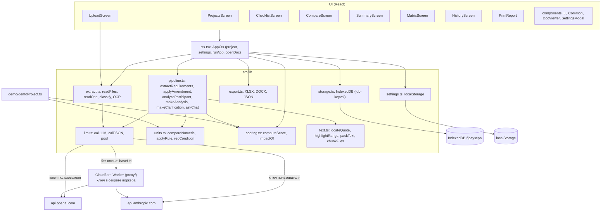

# Архитектура MVP «Тендер-Сверка»

> Статус: MVP (Этап 0). Документ описывает фактическую реализацию в `src/` на 08.10.2026 и путь к целевой архитектуре из раздела 11 ТЗ. Ссылки на ТЗ даны по номерам разделов, текст ТЗ в репозиторий не копируется.

## 1. Ограничения, из которых выросла архитектура

- Нет сервера и бюджета на VPS: только статический хостинг **GitHub Pages**.
- Весь конвейер (распознавание, извлечение, сопоставление, скоринг, экспорт) работает **в браузере**: React 19 + TypeScript + Vite 8 + Tailwind v4.
- LLM (OpenAI или Anthropic) вызывается из браузера: с ключом пользователя или через бесплатный прокси **Cloudflare Worker**, где ключ хранится в секрете воркера.
- Встроенный **демо-проект** работает без ключа и без сети.

## 2. Схема модулей



Направление зависимостей: `screens → ctx → lib → types`. Модули `lib` не импортируют React. Исключение: `export.ts` берёт подписи из `i18n.ts`.

## 3. Поток данных по этапам конвейера

Этапы соответствуют схеме из раздела 11 ТЗ: «оба пакета проходят один конвейер и встречаются на сопоставлении».

| # | Этап | Что происходит | Реализация |
|---|------|----------------|------------|
| 1 | **Приём и распознавание** (оба пакета) | Распаковка ZIP с сохранением путей. Разбор PDF (текстовый слой), DOCX, ODT, RTF, DOC (упрощённо), XLS/XLSX/ODS/CSV, TXT/HTML. Страницы без текстового слоя и изображения распознаются мультимодальной LLM, которая возвращает уверенность и метки `[ПЕЧАТЬ]`, `[ПОДПИСЬ]`, `[QR-КОД]`. Тип файла определяется автоматически, пользователь может его исправить. Текст можно вставить вручную. | `extract.ts`: `readFiles`, `readOne`, `readPdf`, `ocrImage`, `classify`, `textFile`; UI: `UploadScreen`, `DropZone` |
| 2a | **Чек-лист требований** (заказчик) | Документация режется на чанки по 90 тыс. символов с маркерами `[файл, стр. N]` и обрабатывается параллельно (до 3 потоков). LLM возвращает атомарные требования в JSON. Код проверяет цитату по тексту, дедуплицирует пункты, назначает ID `T-xxx`/`U-xxx` и отдельным вызовом ищет противоречия между фрагментами. Найденные проблемы попадают в «Вопросы к заказчику». | `pipeline.ts`: `extractRequirements`, `toReq`, `assignIds`, `crossCheck`; `text.ts`: `chunkFiles`, `locateQuote` |
| 2a′ | Разъяснения и изменения | Новые документы заказчика помечаются `pending`/`isAmendment`. LLM возвращает `modify/add/remove` по текущему чек-листу, изменённые пункты получают `changeNote`. | `pipeline.ts`: `applyAmendment` |
| — | **Утверждение** | Пользователь редактирует, исключает и добавляет пункты, затем нажимает «Утвердить» (`checklistApproved`). Без утверждения сверка не запускается. | `ChecklistScreen` |
| 2b | **Чек-лист заявки** (участник) | LLM извлекает факты о товаре и участнике с цитатами, внутренние противоречия заявки, наименование и ИНН. | `pipeline.ts`: `analyzeParticipant`, этап `stage_facts` |
| 3 | **Сопоставление и маркировка** | Требования обрабатываются пакетами по 15. LLM ищет подтверждение и предлагает статус. Затем `postProcess` проверяет цитату заявки, сравнивает числа кодом после приведения единиц, сравнивает срок действия документа с дедлайном и отправляет пункт на проверку человеком при уверенности ниже порога. Здесь же формируется рекомендация. | `pipeline.ts`: `analyzeParticipant`, `postProcess`; `units.ts`: `applyRule`, `compareNumeric` |
| 4 | **Скоринг и вердикт** | Взвешенный процент: общий, по товару, по участнику и по категориям. Диапазон «от–до» с учётом пунктов на проверке, счётчики, вердикт, прогноз после устранения замечаний, влияние каждого пункта. Каждая проверка сохраняется как версия. | `scoring.ts`: `computeScore`, `impactOf`; `pipeline.ts`: `makeVersion` |
| 5 | **Вывод и рекомендации** | Аналитический вывод (резюме, сильные стороны, риски), черновик запроса на разъяснение, чат по проекту с ответами только по документам. Экспорт XLSX, DOCX, JSON и PDF (через печать). | `pipeline.ts`: `makeAnalysis`, `makeClarification`, `askChat`; `export.ts`; `PrintReport` (frontend) |

Прогресс по этапам передаётся через `ctx.run(progress)`. Коды этапов (`stage_read`, `stage_extract`, `stage_verify`, `stage_facts`, `stage_match`, `stage_score`, `stage_analysis`) переводятся через i18n.

## 4. Модель данных (`src/types.ts`)

```
Project ─┬─ customerFiles: DocFile[] ── pages: DocPage{n, text, ocr?, confidence?}
         ├─ requirements: Requirement[]      (структура пункта из раздела 4.3 ТЗ)
         ├─ questions: Question[]            (contradiction | ambiguity | restrictive)
         ├─ checklistApproved, deadline, lotNumber, customer
         ├─ participants: Participant[] ─┬─ files: DocFile[]
         │                               ├─ facts: Fact[], contradictions: Contradiction[]
         │                               ├─ matches: Record<reqId, Match>
         │                               ├─ versions: Version[]   (история %)
         │                               └─ analysis?: Analysis
         ├─ chat: ChatMsg[], log: LogEntry[], clarificationDraft?
Settings: provider, apiKey, model, baseUrl, reviewThreshold, weights, k, reportLang, uiLang, ocrPageLimit
```

Ключевые типы:
- `SourceRef {fileId, fileName, page, clause?, quote, translation?}` — ссылка на источник. Такая ссылка есть у каждого требования, факта и совпадения.
- `Requirement`: `id`, `scope` (product/participant), `category`, `lotItem`, `parameter`, `operator` (`>= <= = range tolerance exists text date`), `value/valueMax/unit`, `type` (mandatory/scored/desired), `points`, `proof`, `consequence`, `source`, `confidence`, `quoteVerified`, `excluded`, `manual`, `restrictive`, `changeNote`.
- `Match`: `status` и `aiStatus` (`ok partial unconfirmed fail review`), `claimed/claimedValue/claimedUnit`, `confirmedByDoc`, `sourceKind`, `validUntil`, `source`, `rationale`, `confidence`, `method` (rule/llm/manual), `ruleNote`, `manualComment`, `recommendation`, `exceeds`.
- `Recommendation`: `problem`, `action`, `actionType` (`add_doc fix_data replace_product ask_customer unfixable`), `criticality`, `done`. Влияние на итог (`impactOf`) вычисляется, а не хранится.

## 5. Принцип «LLM извлекает и интерпретирует, код считает»

| Задача | Кто делает |
|--------|-----------|
| Найти требование, классифицировать тип, дать цитату | LLM |
| Проверить, что цитата есть в тексте источника | код: `locateQuote` |
| Нормализовать единицы и сравнить числа (≥, ≤, =, диапазон, допуск) | код: `units.ts` (21 размерность: масса, длина, мощность, данные, частота, время, температура, деньги в сумах, «штуки» документов и людей для частичного выполнения «2 из 3») |
| Сравнить срок действия документа (`validUntil`) с дедлайном | код: `postProcess` |
| Смысловые требования («антикоррозийное покрытие», «аналогичный опыт») | LLM с обоснованием и цитатой |
| Процент, вердикт, прогноз, влияние | код: `scoring.ts` |

Если код смог сравнить число, его результат заменяет статус LLM (`method: 'rule'`, `ruleNote`), и в UI видно, что пункт проверен правилом.

## 6. Защита от галлюцинаций

1. **Обязательная цитата.** Промпты требуют дословную цитату и маркеры `[файл, стр. N]`.
2. **Проверка цитаты** (`text.ts: locateQuote`). Поиск идёт сначала на указанной странице, потом по всему файлу, потом по всем файлам пакета. Сравнение нечёткое: нормализация кавычек, тире, «ё», пробелов и совпадение биграмм слов не ниже 0,7. При совпадении в другом месте код исправляет страницу и файл.
3. **Пункт без подтверждённой цитаты исключается из чек-листа.** `toReq` ставит `excluded: true`, `quoteVerified: false`, уверенность не выше 40%. В чек-листе такие пункты помечены «цитата не найдена», пользователь может включить их вручную.
4. **Совпадение без подтверждённой цитаты** получает уверенность не выше 50% и при пороге по умолчанию уходит в «Требует проверки».
5. **Порог уверенности** (`settings.reviewThreshold`, по умолчанию 80%). Ниже порога любой статус, кроме `fail`, меняется на `review`.
6. **Пункты, по которым LLM не вернула результат**, получают статус `review`, а не `ok`.
7. Подсветка цитаты в исходнике (`highlightRange`, `DocViewer`, `QuoteCard`) позволяет проверить вывод одним кликом. Это требование объяснимости из раздела 10 ТЗ.

Известные ограничения: короткие цитаты проверяются слабо, а уверенность OCR пока не влияет на статус. Подробности в замечаниях код-ревью и в `TZ_COVERAGE.md`.

## 7. Скоринг (раздел 7 ТЗ)

$$S = \frac{\sum_i w_i \cdot k_i}{\sum_i w_i} \times 100\%$$

| Статус | k | Тип требования | w |
|---|---|---|---|
| ok | 1,0 | обязательное | 3 |
| partial | 0,5 | оценочное | 2 или `points` из критериев оценки |
| unconfirmed | 0,3 | желательное | 1 |
| fail | 0 | | |
| review | не учитывается в S | | |

- Диапазон «от–до»: `scoreMin` считает пункты `review` как k=0, `scoreMax` как k=1.
- Отдельные проценты: товар, участник и каждая категория (`byCategory`).
- Вердикт: `risk`, если есть обязательный пункт со статусом `fail`; `ready`, если все обязательные пункты `ok` и нет `review`; иначе `needs_work`.
- Прогноз: все устранимые проблемы (кроме `unfixable`) считаются закрытыми. Влияние пункта (`impactOf`) — прирост S, если закрыть только этот пункт.
- Веса, коэффициенты k и порог настраиваются в `SettingsModal`.

## 8. Хранение и конфиденциальность в MVP

| Данные | Где хранятся |
|--------|--------------|
| Проекты (тексты страниц, чек-листы, результаты, история) | IndexedDB браузера, база `tender-sverka/projects` |
| Настройки, включая API-ключ | `localStorage` (`tender-sverka-settings-v1`) |
| Исходные файлы (бинарные) | не хранятся: после разбора остаётся только текст страниц |
| Тексты документов при анализе | отправляются по TLS выбранному провайдеру LLM, напрямую или через прокси |

- Сервера приложения нет: данные одной компании не видны другим, но и резервной копии нет. Очистка браузера удаляет проекты. Перенос между устройствами — через экспорт JSON.
- Ключ в `localStorage` доступен любому скрипту страницы. Для общего использования рекомендуется режим прокси.
- Документы уходят во внешние AI-API. Допустимость этого с учётом закона РУз о персональных данных — открытый вопрос раздела 13 ТЗ. До ответа юриста пилот ведётся только на данных, которые разрешено передавать.

## 9. Режимы AI

| Режим | Условие | Что работает |
|-------|---------|--------------|
| **Демо** | проект `isDemo`, ключ не нужен | Все экраны на заранее подготовленных данных лота 2026-114 (2 участника, 31 требование). Числовые пункты демо прогоняются через `compareNumeric`, проценты и версии считает живой `computeScore`. Новые файлы без AI не анализируются. |
| **Свой ключ** | `settings.apiKey` | Прямые вызовы `api.openai.com` или `api.anthropic.com` (для Anthropic с заголовком `anthropic-dangerous-direct-browser-access`). |
| **Прокси** | `settings.baseUrl` или `VITE_PROXY_URL` при сборке | Cloudflare Worker пересылает `/v1/chat/completions` и `/v1/messages`, ключ хранится в секрете воркера. Пользователю ключ не нужен. Стоит ограничить origin и частоту запросов. |

Воспроизводимость: для OpenAI задаются `temperature: 0` и `seed`. Актуальные модели Claude не принимают `temperature`, поэтому повторяемость обеспечивается фиксацией модели и версии промптов в результатах. Это задача Этапа 1.

## 10. Эволюция к целевой архитектуре (раздел 11 ТЗ)

Целевая архитектура: Python-бэкенд, PostgreSQL + S3, очередь задач, pgvector, специализированный OCR, REST API, интеграции.

**Что сохраняется без переделки:** модель данных `types.ts` (станет JSON-схемой и Pydantic-моделями), промпты, правила `units.ts` и `scoring.ts`, UI. Демо-проект становится регрессионным эталоном: результаты Python-порта должны совпадать с TS-версией до сотых процента.

Порядок выноса на сервер (каждый шаг можно выпустить отдельно, SPA остаётся клиентом):

| Шаг | Что выносим | Зачем | Компоненты |
|-----|-------------|-------|------------|
| 1 | **LLM-шлюз**: прокси превращается в сервис | ключи не попадают в браузер; лимиты, учёт затрат, журнал версий модели и промптов | FastAPI `/llm`, журнал вызовов |
| 2 | **Хранение и доступ** | изоляция компаний, роли, журнал действий, срок хранения, шифрование AES-256, удаление по запросу (раздел 10 ТЗ) | PostgreSQL (проекты, требования, совпадения, версии), S3 для исходных файлов, SSO / вход по телефону |
| 3 | **Приём и распознавание** | сканы и фото по требованиям CER, плотные таблицы, RAR/7Z, TIFF/HEIC, DWG/DXF, лимит 1000 страниц | очередь Celery/RabbitMQ; постраничная обработка; Azure DI / Google Document AI / ABBYY / PaddleOCR / Surya; предобработка (выравнивание, шумы); bbox фрагментов для подсветки области на странице |
| 4 | **Извлечение и сопоставление** | пакеты больше контекста модели, скорость не более 10 минут на 100 страниц, промежуточные результаты | воркеры конвейера; **pgvector**: в промпт сопоставления попадают только релевантные фрагменты, а не весь пакет; JSON-схемы structured output; кэш по хэшу «файл + промпт + модель» для воспроизводимости |
| 5 | **Правила и скоринг на Python** | единый источник истины для отчётов и API | порт `units.ts` и `scoring.ts` с общими тест-векторами |
| 6 | **Интеграции** | работа в экосистеме | REST API, webhooks, импорт лота из TenderZone, модуль комиссии TenderGPT, проверка ИНН по реестрам |

Переходный режим: SPA с переключателем «локально / сервер». В локальном режиме остаются демо и офлайн-проверка, в серверном — общий доступ команды.
